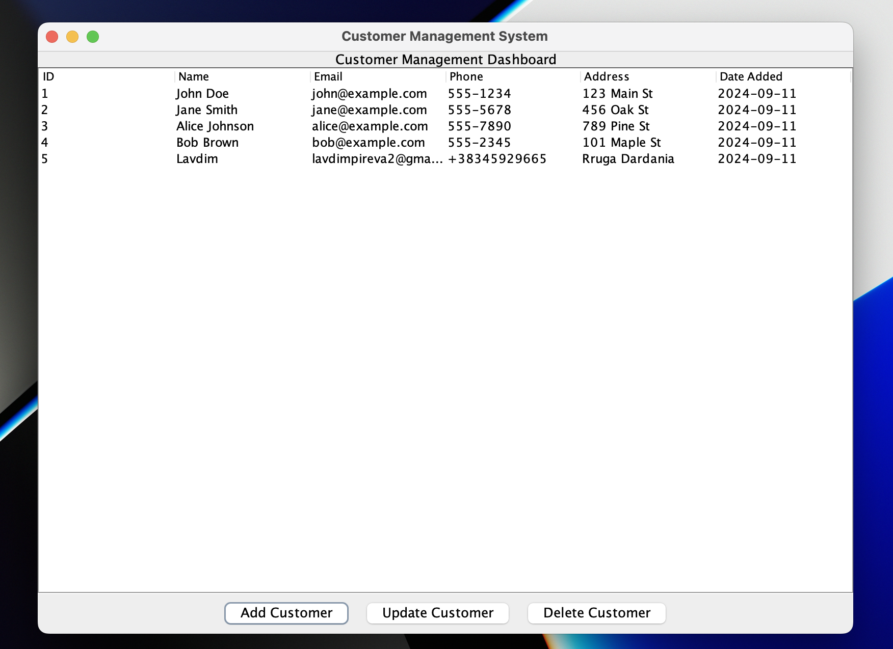

# CRM Application (Java, PostgreSQL, Swing)

## Overview
This is a simple CRM (Customer Relationship Management) application developed in Java using Java Swing for the user interface and PostgreSQL for the database. The application allows users to manage customer information, including adding, updating, and deleting customers from a database.


## Screenshot
Here is an example of the user interface:



## Table of Contents
- [Features](#features)
- [Technologies Used](#technologies-used)
- [Installation](#installation)
- [Database Setup](#database-setup)
- [Running the Application](#running-the-application)
- [Usage](#usage)
- [Validation](#validation)


## Features
- Add new customers with details such as name, email, phone number, and address.
- Update existing customer information.
- Delete customers from the database.
- View a list of all customers.
- Input validation to ensure data integrity.
- A responsive user interface built with Java Swing.
- Real-time table updates after operations (insert, update, delete).

## Technologies Used
- **Java**: Core language used for the application logic and GUI (Swing).
- **Java Swing**: For building the user interface.
- **JDBC**: For database connectivity.
- **PostgreSQL**: Used for database storage.
- **Maven**: For project management and dependency management.


### Steps to Install
1. Clone the repository:
    ```bash
    git clone https://github.com/lavdimPireva/CRM-PROJECT.git
    cd CRM-PROJECT
    ```
2. Open the project in your IDE (e.g., IntelliJ IDEA).
3. Set up the **PostgreSQL** database (see instructions below).
4. Build the project using **Maven**:
    ```bash
    mvn clean install
    ```
## Database Setup

1. Log into your PostgreSQL instance:
    ```bash
    psql -d customer
    ```
2. Create a database for the CRM application:
    ```sql
    CREATE DATABASE customer;
    ```
3. Switch to the `customer` database:
    ```bash
    \c customer
    ```
4. Create the `customers` table:
    ```sql
    CREATE TABLE IF NOT EXISTS customers (
        id SERIAL PRIMARY KEY,
        name VARCHAR(255) NOT NULL,
        email VARCHAR(255) NOT NULL,
        phone VARCHAR(50),
        address VARCHAR(255),
        date_added DATE DEFAULT CURRENT_DATE
    );
    ```
5. (Optional) Insert some test data:
    ```sql
    INSERT INTO customers (name, email, phone, address)
    VALUES 
        ('John Doe', 'john@example.com', '555-1234', '123 Main St'),
        ('Jane Smith', 'jane@example.com', '555-5678', '456 Oak St');
    ```
6. Make sure your PostgreSQL is running and that the database connection credentials (URL, username, password) in your **`DatabaseConnection.java`** class are correctly configured.

## Running the Application

1. After setting up the database and building the project, run the application:
    - If using **IntelliJ IDEA**, run the `MainUI` class directly from the IDE.
    - Or, if you prefer the command line:
      ```bash
      mvn exec:java -Dexec.mainClass="org.example.ui.MainUI"
      ```

2. The GUI window will appear, showing the Customer Management System.

## Usage
1. **Adding a Customer**:
    - Click the "Add Customer" button.
    - Fill in the customer’s details and press **OK**.
    - If validation passes, the customer will be added to the database.

2. **Updating a Customer**:
    - Select a customer from the table.
    - Click the "Update Customer" button.
    - Modify the customer’s details and press **OK**.

3. **Deleting a Customer**:
    - Select a customer from the table.
    - Click the "Delete Customer" button.
    - Confirm the deletion in the dialog.

## Validation
The application includes validation for the following fields:
- **Email**: Must be in a valid email format.
- **Phone**: Must be a valid phone number (can include digits, spaces, and `+`).
- **Name**: Must not be empty.

## SQL Commands Used

Some of the key SQL commands used in this application include:
- `\dt`: List all tables in the database.
- `\c customer`: Switch to the customer database.
- `CREATE TABLE`: Create the `customers` table.
- `INSERT INTO`: Insert test data into the `customers` table.
- `SELECT * FROM customers`: Query all customers from the database.

  
  
